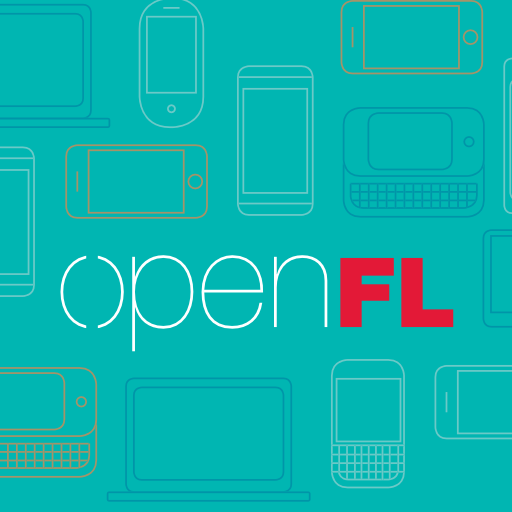

  

 

Introduction
============

OpenFL (Open Flash Library) is a fast, open-source implementation of the industry-standard Flash API. Unlike the Adobe implementation, OpenFL uses hardware rendering, compiles to native C++ for target platforms and reaches many more platforms than Adobe AIR. OpenFL is also 100% compatible with Flash Player, so you can still target Flash in the browser, or even AIR if you want.

Also unlike Adobe Flash, OpenFL uses the [Haxe](http://haxe.org/) programming language. Before Adobe abandoned the "ActionScript Next" project, they detailed the pitfalls of ActionScript, and how they felt the language needed to improve. If you have a history performing ActionScript 3 development, you can almost approach Haxe as if it were ActionScript 4. It is powerful, flexible, has many more features and the first version of Haxe (with AVM2 support) was even released before Flash CS3 (with ActionScript 3 support) -- Haxe (and before it, MTASC) has a long history of supporting Flash.

Platforms
=========

We are in the process of moving to a portable codebase. Existing releases of OpenFL support:

 * Windows
 * Mac
 * Linux
 * iOS
 * Android
 * BlackBerry
 * Tizen
 * Firefox OS
 * HTML5
 * Flash

The new codebase supports the following:

 * Windows
 * Mac
 * Linux
 * HTML5
 * Flash

With other platforms being added again before the final release. 

Libraries
=========

OpenFL is compatible with [many libraries](http://lib.haxe.org/all), ported from ActionScript or written originally in Haxe, including:

 * [HaxeFlixel](https://github.com/haxeflixel/flixel)
 * [HaxePunk](https://github.com/HaxePunk/HaxePunk)
 * [Nape](https://github.com/deltaluca/nape)
 * [Box2D](https://github.com/jgranick/Box2D)
 * [Actuate](https://github.com/jgranick/Actuate)

OpenFL also powers other platforms, such as [Stencyl](http://www.stencyl.com/) 3.

In order to support SWF assets, you can use the OpenFL [SWF](http://github.com/openfl/swf) library, but many developers use image assets or libraries for spritesheet/tilesheet assets instead, as they can perform faster on mobile.

Code Editors
============

Plugins have been written for many [code editors](http://haxe.org/com/ide), but the most popular editors used for Haxe and OpenFL development are:

 * [FlashDevelop](http://www.flashdevelop.org)
 * [Sublime Text](http://www.sublimetext.com) (with [plugin](https://github.com/clemos/haxe-sublime-bundle))
 * [IntelliJ IDEA](http://www.jetbrains.com/idea/) (with [plugin](http://plugins.jetbrains.com/plugin/6873?pr=))

Easy Deployment
===============

OpenFL is powered by [Lime](https://github.com/openfl/lime), which includes powerful command-line tools to make cross-platform deployment sensible.

"openfl test <target>" is usually all that is required to build, package, install and run your project on the platform of your choice, assuming you have the standard target SDK installed (such as Xcode or Visual Studio C++). Lime includes "setup" commands to even help the install of these standard tools.

3D Support
==========

The Flash API is ideal for 2D development. If you would like to create original 3D content, you might enjoy using [Lime](https://github.com/openfl/lime). You can also mix OpenGL content in OpenFL using OpenGLView API.

The Away Foundation is also developing an OpenFL version of [Away3D](https://github.com/away3d/away3d-core-openfl/).

Native Extensions
=================

When you target a native platform, the output is true native C++, enabling deep integration with platform features and third-party SDKs. There is a standard Haxe "CFFI" API for connecting Haxe classes directly to C++ libraries.

We have also developed a straight-forward Android library project API for adding Java-based extensions, too. Native extensions can also use the standard Lime project format, for flexible control over dependencies, adding additional assets or tuning the output of your project.

The result are native extensions that can be made to interchangeably drop into projects, without breaking one another. We have made no attempt to emulate the system for AIR native extensions, which are much more difficult to create and less flexible.

Core Components
===============

 * [openfl](https://github.com/openfl/openfl)
 * [lime](https://github.com/openfl/lime)
 * [hxcpp](https://github.com/HaxeFoundation/hxcpp)

OpenFL relies upon [Lime](https://github.com/openfl/lime), a foundation for easy, cross-platform development.

[hxcpp](https://github.com/HaxeFoundation/hxcpp) is used automatically by the Lime tools to manage the C++ compilation process for each platform, and to provide the Haxe standard library for C++ support.

License
=======

OpenFL is free, open-source software under the [MIT license](LICENSE.md).

Installing OpenFL
=================

Follow the directions at [openfl.org](http://www.openfl.org/download).

Development Builds
==================

Clone the OpenFL repository:

    git clone https://github.com/openfl/openfl

Tell haxelib where your development copy of OpenFL is installed:

    haxelib dev openfl openfl

To return to release builds:

    haxelib dev openfl
